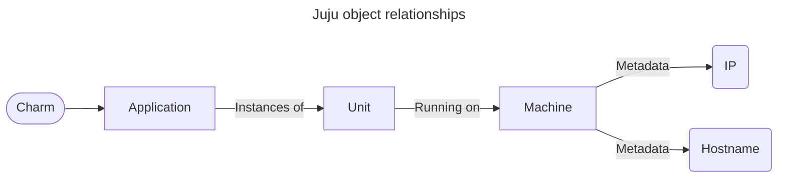

# Juju Jockey 

## Overview

Jockey is a CLI tool designed to facilitate quick and easy retrieval of Juju objects using filters.  It uses automatic caching of Juju's status in json format to enable faster parsing.  

Jockey relies on this model of Juju objects and how they are related:


All filtering actions are performed by navigating this tree.

## Command Anatomy

The anatomy of a Jockey command is as follows:
```
jockey <object> <filters> <options>
```

`<object>` refers to any of the searchable Juju objects, such as applications and units.  `<filters>` is a space delimited list of filters (see below).

### Filters

Filters follow a specific syntax and allow the user to limit Jockey's output to meet certain criteria.  All filters have this structure:
```
<object><filter-code><content>
```
Just like in the origial `jockey` command anatomy, `<object>` is any of the searchable Juju objects.  

## Getting Started
### Installing Dependencies
First, make sure you have Poetry installed. If not, please refer to the
[Poetry installation guide](https://python-poetry.org/docs/#installation).
Then, install all the required dependencies for Jockey:
```bash
poetry install
```

This command will create the virtual environment and install all the necessary packages as defined in
[`pyproject.toml`](pyproject.toml).

### Using Jockey
Once installed, you can interact with the Jockey directly:

```bash
poetry run jockey --help
```

### Hacking with Jockey
#### Entering the Virtual Environment
To work within the virtual environment created by Poetry:
```bash
poetry shell
```

This will activate the virtual environment.
You will need to do this each time you start a new session.

#### Performing checks locally
```bash
# Lint import order with isort
poetry run isort src --check

# Fix import order with isort
poetry run isort src

# Lint with flake8
poetry run flake8 src

# Lint with mypy
poetry run mypy src

# Lint code format with black
poetry run black src --check

# Fix code format with black
poetry run black src

# Execute unit tests
poetry run pytest -s
```

## Examples:

<!-- jockey units -->
<details>
<summary><code>jockey units</code></summary>
<pre>
ceph-osd/0 telegraf-ceph/2 ceph-osd/1 telegraf-ceph/1 ceph-osd/2 telegraf-ceph/0 mysql-innodb-cluster/0 telegraf-mysql/0
</pre>
</details>

<!-- jockey units charm=ceph-osd -->
<details>
<summary><code>jockey units charm=ceph-osd</code></summary>
<pre>
ceph-osd/0 ceph-osd/1 ceph-osd/2
</pre>
</details>

<!-- jockey units app/'control|dash' -->
<details>
<summary><code>jockey units app/'control|dash'</code></summary>
<pre>
controller/0 juju-dashboard/0
</pre>
</details>


<!-- jockey charms machine=1 -->
<details>
<summary><code>jockey charms machine=1</code></summary>

> **Note**
> Sorry, the `machine` filter is not yet implemented; stay tuned!

</details>

<!-- jockey app charm=charm-nrpe machine=4/lxd/2 -->
<details>
<summary><code>jockey app charm=charm-nrpe machine=4/lxd/2</code></summary>

> **Note**
> Sorry, the `app` filter is not yet implemented; stay tuned!

</details>

<!-- jockey units app^=nova principal=true hostname~blrt -->
<details>
<summary><code>jockey units app^=nova principal=true hostname~blrt</code></summary>

> **Note**
> Sorry, the `app` filter is not yet implemented; stay tuned!

</details>

## Wishlist:

* Allow comma-delimited selection of multiple object types:
    `jockey get unit,app`
* Filter by leadership
* Filter by principal
* Filter by lxd
