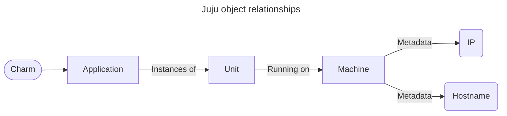

<div align="center">

# Juju Jockey

*Juju objects at your fingertips 🫰*

[![License][shield-license]][url-license]
![Python Version][shield-python]
![Programming Language][shield-language]
[![Tests][shield-tests]][url-tests]
[![Contributors][shield-contributors]][url-contributors]

[shield-license]: https://img.shields.io/github/license/LCVcode/jockey?style=for-the-badge
[shield-contributors]: https://img.shields.io/github/contributors/LCVcode/jockey?style=for-the-badge
[shield-python]: https://img.shields.io/python/required-version-toml?tomlFilePath=https%3A%2F%2Fraw.githubusercontent.com%2FLCVcode%2Fjockey%2Fmaster%2Fpyproject.toml&style=for-the-badge
[shield-language]: https://img.shields.io/github/languages/top/LCVcode/jockey?style=for-the-badge&logo=python
[shield-tests]: https://img.shields.io/github/actions/workflow/status/LCVcode/jockey/ci.yml?style=for-the-badge&label=tests

[url-license]: LICENSE
[url-contributors]: https://github.com/LCVcode/jockey/graphs/contributors
[url-tests]: https://github.com/LCVcode/jockey/actions/workflows/ci.yml

</div>

## Overview

Jockey is a CLI tool for querying Juju model data with concise filter expressions.
It currently supports querying **units** and **machines** and can filter them
using related object values (applications, charms, hostnames, IPs, and
availability zones).

Jockey relies on this model of Juju objects and how they are related:

```mermaid
---
title: Juju object relationships
---
flowchart LR
    C([Charm]) --> A[Application]
    A -->|Instances of| U[Unit]
    U -->|Running on| M[Machine]
    M -->|Metadata| M_I(IP)
    M -->|Metadata| M_H(Hostname)
```

All filters are evaluated by traversing these relationships.

## Current support

### Query targets

Only the following `OBJECT` query targets are currently supported:

- `unit`, `units`, `u`
- `machine`, `machines`, `m`

Other object aliases are valid in **filter expressions** but are not currently
valid as top-level query targets.

### Filter object aliases

You can filter unit or machine results using these object aliases:

- **Charm:** `charm`, `charms`, `c`
- **Application:** `application`, `applications`, `app`, `apps`, `a`
- **Unit:** `unit`, `units`, `u`
- **Machine:** `machine`, `machines`, `m`
- **IP:** `ips`, `address`, `addresses`, `ip`, `i`
- **Hostname:** `hostnames`, `hostname`, `host`, `hosts`, `h`
- **Availability Zone:** `availability-zone`, `availability_zone`, `az`, `zone`

### Filter operators

| Token | Meaning |
|---|---|
| `=` | equals |
| `^=` | not equals |
| `~` | contains |
| `^~` | does not contain |

## Command anatomy

The CLI shape is:

```
juju-jockey <OBJECT> [EXPRESSION ...] [OPTIONS]
```

Each filter expression has this form:

```
<OBJECT><OPERATOR><CONTENT>
```

Examples:

- List all units:
  ```bash
  juju-jockey units
  ```
- List machines that have a unit from application `etcd`:
  ```bash
  juju-jockey machines app=etcd
  ```
- List units on machines with hostnames containing `node`:
  ```bash
  juju-jockey units host~node
  ```
- List non-LXD machines:
  ```bash
  juju-jockey m m^~lxd
  ```

## Data sources and caching

- `--file /path/to/status.json` queries a local Juju status JSON file.
- Without `--file`, Jockey queries Juju CLI output and uses a local cache.
- The in-memory status used for filtering is intentionally narrowed to fields
  needed by the currently supported query/filter paths.
